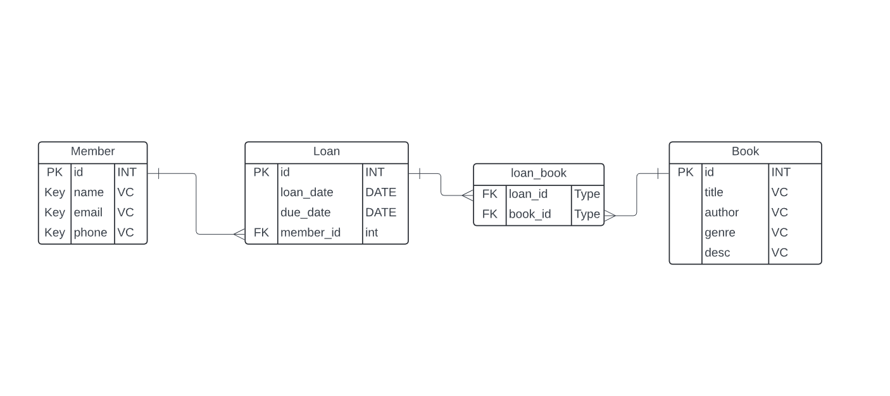

### Lesson: Understanding ORMs and SQLAlchemy Relationships

### **Recap on ORMs**

#### **What is an ORM?**

An **Object-Relational Mapper (ORM)** is a programming technique that allows developers to interact with a SQL relational database using object-oriented paradigms. ORMs map Python classes (or objects) to database tables, allowing you to perform database operations without writing SQL queries manually.

#### **Benefits of Using an ORM**

*   **Abstraction:** Hide the complexity of SQL queries.
    
*   **Productivity:** Write Python code to interact with databases instead of SQL.
    
*   **Portability:** Easily switch between different database systems (SQLite, PostgreSQL, MySQL, etc.).
    
*   **Security:** Helps prevent SQL injection by using parameterized queries.
    

#### **Common ORMs in Python**

*   **SQLAlchemy**: One of the most powerful and flexible ORMs.
    
*   **Django ORM**: Used in the Django framework, but more tightly coupled to its ecosystem.
    
*   **Peewee**: A lightweight ORM for small projects.
    

**SQLAlchemy** is a popular ORM in Python that provides a high-level API for database interactions. In this lesson, we will cover:

1.  Basic SQLAlchemy table setup.
    
2.  Defining one-to-one, one-to-many, and many-to-many relationships.
    

### Setting Up SQLAlchemy

Before diving into relationships, let’s set up a basic SQLAlchemy model. First and foremost, to use SQLAlchemy we need to install it, and to do that we need to first set up our virtual environment.

```
- windows
python -m venv venv

- mac
python3 -m venv venv
```

Once we have created our virtual environment we need to activate the environment

```
- windows
venv\Scripts\activate

- mac
source venv/bin/activate

```

Now that we have our environment active we can start installing packages to the environment i.e. SQLAlchemy as well as our database interpreter that is going to be the translator between our python classes and SQL tables.

```
- windows 
pip install flask flask-sqlalchemy mysql-connector-python

-mac
pip3 install flask flask-sqlalchemy mysql-connector-python
```

Now that we have our environment set up and our dependancies installed lets set up our basic flask app.

```
from flask import Flask
from flask_sqlalchemy import SQLAlchemy
from sqlalchemy.orm import DeclarativeBase

app = Flask(__name__)
app.config['SQLALCHEMY_DATABASE_URI'] = 'mysql+mysqlconnector://root:<YOUR MYSQL PASSWORD>@localhost/<YOUR DATABASE>'


# Create a base class for our models
class Base(DeclarativeBase):
    pass
 
#Instantiate your SQLAlchemy database

db = SQLAlchemy(model_class = Base)

db.init_app(app) #adding our db extension to our app


```
---
We're going to be using our Library ERD from last class to serve as the blueprint for building our database




### Creating Tables using our ORM

- To create our main tables Member, Loan, and Book we will create classes that inherit from our `Base` class.

- The Class attributes will serve as `fields` when using `mapped_column` for additional constraints

- The Class attributes will serve as relationship attributes utilizing `relationship()` from the SQLAlchemy package

- To create a 'junction table', we'll use a SQLAchemy Table object, instead of making a whole class model

### Manipulating the data in our database

- `CREATE`: We'll create data by creating instances of our Model classes and commiting them to our database
- `READ`: We can read the data using the `select` statement to build a query to retrieve our instances from the database
- `UPDATE`: After querying an object, we can reassign it attribute (user.name = 'new_name') and then commit the changes to the database
- `DELETE`: We can delete instances by using the `delete` statement to delete the instance from the session

### Utilizing our Relationships

- To access related objects we can reference an objects relationship attributes, and they will return the object(s)

```
user.pets #returns a list of Pet objects
pet.owner #returns a User object
```

- Adding to relationships depends on what kind of relationship it is.

    - If you are on the Many side in a One-to-Many, meaning you only relate to one object
    `pet.owner = user #setting the owner to the User object`
    - If you are on the One side meaning your relate to Many objects, you treat this relationship like a list
    `user.pets.append(pet) #adding the pet to the list of pet objects you are related to`

  